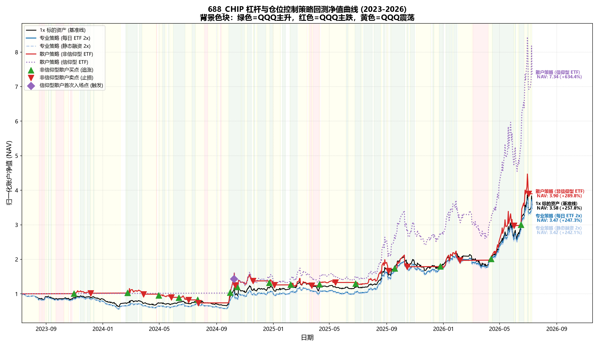
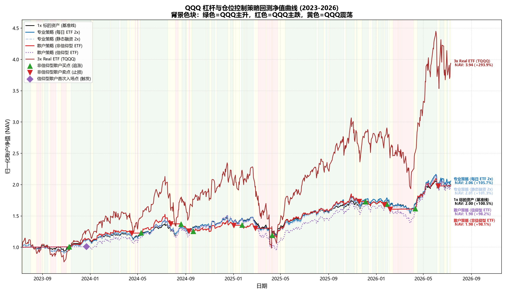
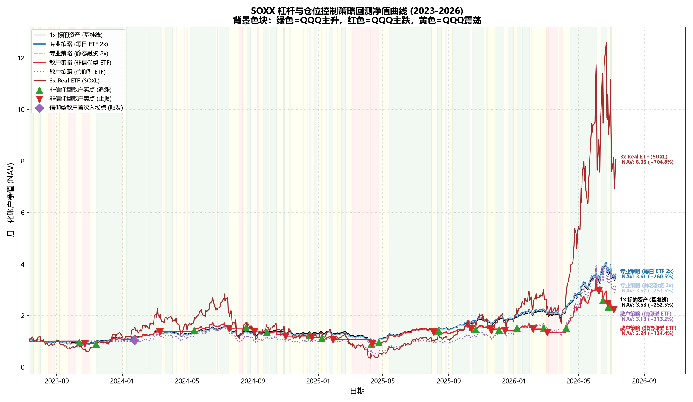
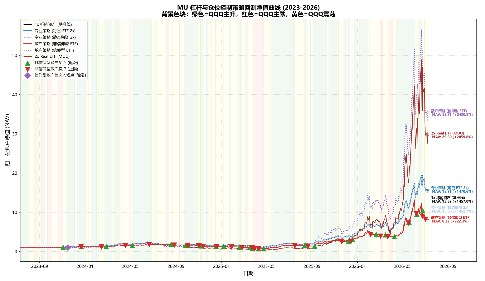
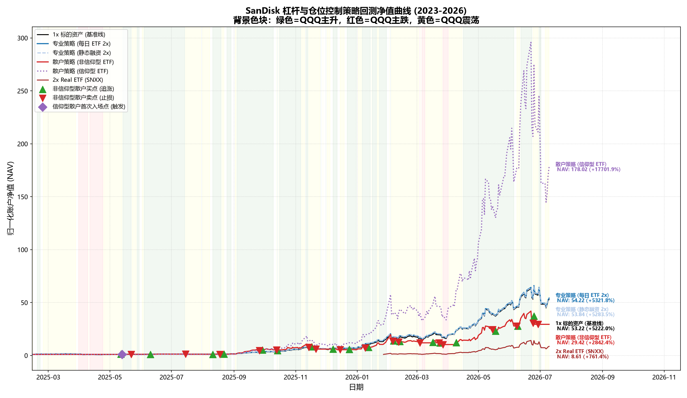
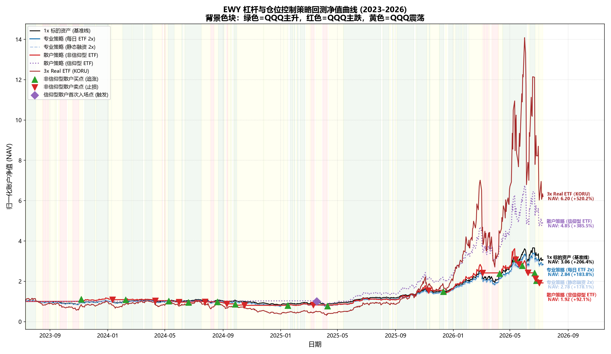

# 杠杆、波动率与收益深度研究及策略回测分析报告 (第一阶段研究报告)

## 摘要
本报告研究了过往三年（2023年7月11日至2026年7月11日）中国、美国及韩国主流科技和半导体资产在静态杠杆及动态分配策略下的表现。为了修正传统模拟中每日重置 ETF 虚高的收益，研究在杠杆 ETF 仿真中引入了衍生品互换融资摩擦成本。同时，通过设计机构级“大盘与个股协同趋势-滚动波动率双重风控策略”与“散户直观情绪感觉仓位调节模型”，对比分析了风险控制策略与两类散户画像在面临高波动环境下的杠杆损耗与夏普比率变化，为高波动科技资产的杠杆配置提供了多维度的学术量化结论。

## 第一部分：数据定义与前置解释 (Data Definitions)
为了保证回测的学术缜密性，本研究所涉及的所有前置假设、数据源、产品利息及费用摩擦成本设定如下：

### 1. 数据源与资产代码对照
- **数据服务提供商**：Yahoo Finance 历史日频 OHLCV 数据库。
- **回测资产列表与时间范围**：
  1. **688_CHIP** (科创芯片)：对应 `588200.SS` (华安科创芯片ETF)。国内目前无做多杠杆产品，以本资产作为每日杠杆 ETF 底层标的。
  2. **QQQ** (纳指100)：对应 Invesco QQQ Trust ETF，以 `TQQQ` 作为真实 3x 杠杆对比标的。
  3. **SOXX** (费城半导体)：对应 iShares Semiconductor ETF，以 `SOXL` 作为真实 3x 杠杆对比标的。
  4. **MU** (美光)：存储芯片个股标的，以 `MUU` 作为真实 2x 杠杆对比标的。
  5. **SanDisk** (闪迪)：独立上市后的个股资产。由于闪迪 (SNDK) 历史走势复利极其恐怖，为了学术分析的实际参考价值，**回测去除了上市前拼接西部数据 (WDC) 的历史，仅从其实际独立上市日 (2025年2月24日) 开始进行纯粹的上市后历史回测**。以 `SNXX` 作为真实 2x 杠杆对比标的。
  6. **EWY** (韩国指数)：对应 iShares MSCI South Korea ETF，以 `KORU` 作为真实 3x 杠杆对比标的。

### 2. 利率与费率设定 Prerequisite Constants
- **借贷融资年化利息率 $r_f$**：国内资产 (688_CHIP) 设定为 **4.0%**；美股及韩股资产统一设定为 **6.5%**。
- **每日重置型杠杆 ETF 管理费率设定**：
  - **美国及韩国标的**：默认设定为 **0.95%** 年化费率（对应真实的 TQQQ, SOXL, KORU 费率）。
  - **中国虚拟标的 (688_CHIP)**：模拟管理费设定为美国的 2.0 倍，即年化 **1.90%**。
- **交易费用率 $C_{\text{trans}}$**：所有调仓操作扣除 **0.1%** 双边交易滑点与佣金费用。
- **维持担保比例平仓线 (MMR)**：静态融资账户在担保比例低于 **130%** 时触发强制清仓平仓。

### 3. 融资类型定义 (Margin Types)
在静态杠杆对照与动态策略回测中，我们对融资杠杆（即向券商借资买入资产）细分了两种物理实现机制：
1. **Margin Constant (恒定融资杠杆)**：
   - **机制**：每日收盘时强制重新调仓以维持固定杠杆比例（如恒定 2.0x 杠杆）。当股价上涨、杠杆率被动稀释时，增借资金加仓；当股价下跌、杠杆率被动放大时，卖股还债减仓。
   - **损耗与特征**：由于每日重置调仓，该模式会承受与每日重置型杠杆 ETF 完全相同的**波动率损耗 (Volatility Drag)**，唯一区别是其摩擦来自每日计提的融资利息 $r_f$ 而非杠杆 ETF 的管理费。
2. **Margin Static (静态融资杠杆)**：
   - **机制**：买定离手，借款本金金额在买入后保持绝对固定，全程**不进行任何每日再平衡调仓**。当股价上涨时杠杆率被动稀释，股价下跌时杠杆率被动放大。
   - **损耗与特征**：该模式不承受每日调仓带来的波动率损耗。但在高波动下跌行情中，其被动杠杆会急速膨胀，面临在担保比例跌破 **130% (MMR)** 平仓线时被强制清盘爆仓（收益归零 **-100%**）的致命生存风险。

## 第二部分：策略定义与量化公式 (Strategy Definitions)
### 1. 机构级专业策略的实现路径
机构级策略核心是建立在大盘-个股动量协同与滚动历史波动率之上的**多因子动态风控调节模型**。在回测中，机构策略分为两个独立的实现路径：

*   **实现路径 1：仅使用每日做多 ETF 调整杠杆 (Daily ETF Path)**
    *   投资标的仅为 1x 标的现货与对应模拟/真实杠杆 ETF。
    *   当仓位暴露 $E_t \in [0.0, 1.0]$ 时，按比例在 2.0% 无风险利率现金与 1x 现货之间分配。
    *   当仓位暴露 $E_t \in [1.0, 2.0]$ 时，按照权重 $w_{\text{etf}} = \frac{E_t - 1.0}{L_{\text{max}} - 1.0}$ 购买杠杆 ETF，余下权重 $w_{1x} = 1.0 - w_{\text{etf}}$ 购买 1x 现货，不使用融资账户。
*   **实现路径 2：仅使用融资调整杠杆 (Margin Path)**
    *   投资标的仅为 1x 标的现货，不借助任何杠杆 ETF。
    *   当仓位暴露 $E_t > 1.0$ 时，多出的暴露部分通过向券商借资买入现货，每日账户结算计提 $(E_t - 1.0) \times \frac{r_f}{365}$ 的利息成本，并在每次仓位调整时产生双边 0.1% 的滑点摩擦成本。融资受 130% 维持担保比例限制。

#### 协同逻辑与核心公式
- **宏观过滤器 (QQQ Trend Filter)**：
  - QQQ 金叉 (Bullish)：$Close^{\text{QQQ}}_{t-1} > EMA_{20}(Close^{\text{QQQ}})_{t-1} > EMA_{50}(Close^{\text{QQQ}})_{t-1}$
  - QQQ 死叉 (Bearish)：$Close^{\text{QQQ}}_{t-1} < EMA_{20}(Close^{\text{QQQ}})_{t-1} < EMA_{50}(Close^{\text{QQQ}})_{t-1}$
- **协同行情划分 (Bull / Bear / Oscillate)**：
  - **主升期 (Bull)**：QQQ 大盘处于 Bullish 金叉，且昨日 $Close^{\text{asset}}_{t-1} > EMA_{20}(Close^{\text{asset}})_{t-1}$。基准暴露量为：$E_{\text{base}} = 1.0 + (L_{\text{max}} - 1.0) \times F_{\text{vol}}$。
  - **主跌期 (Bear)**：QQQ 大盘处于 Bearish 死叉，且昨日 $Close^{\text{asset}}_{t-1} < EMA_{20}(Close^{\text{asset}})_{t-1}$。基准暴露量降为防守上限：$E_{\text{base}} = 0.8$。
  - **震荡期 (Oscillate)**：其余情况。基准暴露量进行折中处理：$E_{\text{base}} = 1.0 + 0.7(L_{\text{max}} - 1.0) \times F_{\text{vol}}$。
- **滚动历史波动率风控因子 $F_{\text{vol}}$**：
  $$F_{\text{vol}} = \max\left(0, 1 - \frac{\sigma_{20d}}{\sigma_{\text{target}}}\right)$$
  化学公式，其中 $\sigma_{20d}$ 是 20 日年化滚动历史波动率。高波动标的（688_CHIP, MU, SanDisk）的 $\sigma_{\text{target}} = 35\%$，其余标的为 $25\%$。
- **大盘偏离协同修正**：
  计算 60 日个股与大盘累计相对偏离度 $Rel_{t-1} = R^{\text{asset}}_{60d, t-1} - R^{\text{QQQ}}_{60d, t-1}$。
  - **落后补涨状态**：当 $Rel_{t-1} < -10\%$ 时，若进入主跌期，强制将仓位拉升至 $E_t = 1.0$（保留现货不降仓，博弈估值收敛）。
  - **超涨状态**：当 $Rel_{t-1} > 10\%$ 时，若在主升或震荡期，则杠杆低配，仓位下调 $\Delta E = 0.3$，即 $E_t = \max(1.0, E_{\text{base}} - 0.3)$（降温风控）。

### 2. 散户直观情绪感觉策略的实现路径
散户投资决策不依靠均线、EMA 等公式计算，而是基于昨日市场新高新低等直观“情绪感觉”。**实现路径仅支持“使用每日做多 ETF 调整仓位”**。

#### A. 情绪感觉的量化公式
散户的前一日感觉根据以下三个具体的突破和异动指标在每日开盘前（t）进行判定：
- **感觉主升 (Feel Bull)**：昨日价格突破前 20 日最高价，或昨日单日触发放量大涨（“一阳改三观”）：
  $$Close_{t-1} \ge \max_{1 \le i \le 20}(Close_{t-1-i}) \quad \text{或昨日触发“一阳改三观”}$$
  *注：“一阳改三观”指昨日单日涨幅 $Return_{t-1} > 4\%$ 且昨日成交量 $Volume_{t-1} > 2.0 \times \text{Mean}(Volume)_{20d, t-1}$。*
- **感觉主跌 (Feel Bear)**：昨日价格跌破前 20 日最低价，或昨日单日触发放量大跌（“一阴改三观”）：
  $$Close_{t-1} \le \min_{1 \le i \le 20}(Close_{t-1-i}) \quad \text{或昨日触发“一阴改三观”}$$
  *注：“一阴改三观”指昨日单日跌幅 $Return_{t-1} < -4\%$ 且昨日成交量 $Volume_{t-1} > 2.0 \times \text{Mean}(Volume)_{20d, t-1}$。*
- **感觉震荡 (Feel Oscillate)**：昨日收盘处于 20 日价格区间内，且未发生上述放量大涨大跌时的其余普通情况。

#### B. 画像细分与仓位范围约束
- **非信仰型散户 (Non-Believer)**：
  - **仓位范围**：**0% - 200%**。空仓起步 (0% 仓位)。
  - **进场激活**：10日制造累计涨幅 $>10\%$ 或进入“感觉主升”状态，直接将仓位拉满至 **2.0x 杠杆**。
  - **持仓调仓**：感觉主升持 2.0x 杠杆；感觉震荡仓位降为 1.0x 纯现货；当处于“感觉主跌”或账户净值自最高点回撤超过 **8%** 时，触发恐慌清仓割肉，**仓位瞬间降至 0%**，无冷静期。
- **信仰型散户 (Believer)**：
  - **仓位范围**：**最低持仓不低于 80%** (80% - 200% 波动)。空仓起步。
  - **进场激活**：60 日超额收益率跑赢 QQQ 超 15% 进场。若标的本身是基准 QQQ，则以其 60 日绝对收益率超过 15% 激活，买入 2.0x。
  - **持仓调仓**：感觉主升持 **2.0x** 杠杆；感觉震荡仓位降为 **1.5x** 折中；处于“感觉主跌”时，由于信仰坚强，绝不全额割肉或清仓，**退守到 0.8x 现货（80% 仓位）死拿死扛**。

## 第三部分：各标的资产过往三年行情识别与波动率特征分析
在对标的运行仓位策略前，我们首先对其过往三年的行情特征与在三大宏观状态（基于 QQQ 过滤）下的年化波动率表现进行了前置量化分析：

| Asset    |   总天数 |   主升天数 |   主跌天数 |   震荡天数 | 总体年化波动率   | 主升年化波动率   | 主跌年化波动率   | 震荡年化波动率   | 行情特征归类   |
|:---------|------:|-------:|-------:|-------:|:----------|:----------|:----------|:----------|:---------|
| 688_CHIP |   726 |    452 |     98 |    176 | 43.66%    | 46.54%    | 34.85%    | 40.33%    | 震荡上行牛市   |
| QQQ      |   753 |    462 |    109 |    182 | 20.29%    | 15.89%    | 31.66%    | 21.57%    | 震荡上行牛市   |
| SOXX     |   753 |    462 |    109 |    182 | 38.39%    | 33.86%    | 50.15%    | 41.14%    | 震荡上行牛市   |
| MU       |   753 |    462 |    109 |    182 | 61.27%    | 57.19%    | 69.66%    | 66.07%    | 超级主升长牛   |
| SanDisk  |   352 |    206 |     66 |     80 | 102.90%   | 97.29%    | 101.58%   | 115.94%   | 超级主升长牛   |
| EWY      |   753 |    462 |    109 |    182 | 35.25%    | 33.25%    | 43.66%    | 34.56%    | 震荡上行牛市   |

### 量化结果解读：
1. **行情非对称性**：主升期天数远超主跌期天数，这为杠杆策略长线获取复利提供了极佳环境。
2. **主跌期波動率飙升特征**：所有资产在主跌期（Bear）的波动率均显著高于主升期（Bull）。例如，**SOXX** 在主跌期的年化波动率高达 **50.15%**，而主升期仅为 **33.86%**。这导致了静态杠杆在下跌和震荡期承受成倍的波动率损耗。
3. **个股极端波动率**：**MU** 与 **SanDisk** 拥有极高的总体年化波动率。在高波动个股上，波动率损耗是致命的，这也正是为什么在个股上引入动态波动率风控或散户直观避险调节显得尤为关键。

## 第四部分：研究精要与学术结论总结 (Research Summary & Academic Conclusions)
结合回测数据及三大行情阶段的深入解构，本研究关于杠杆、波动率与动态配置的学术结论总结如下：

### 1. 波动率损耗（Volatility Drag）的杀伤力及其风控必要性
- 每日重置型杠杆产品（ETF 与 恒定融资）在面临高波动且宽幅震荡的资产时，损耗极其惨烈。负复利效应因子 $-\frac{1}{2}L(L-1)\sigma^2$ 表明，当波动率高时，在非单边主升行情中静态持仓会被严重剥夺净值。对于高波动个股（如美光和上市后的闪迪），静态高杠杆并不适宜长期持有。
- 机构策略引入**滚动历史波动率调节器**，在个股年化波动率高时自动降低杠杆成数，能够在中期震荡和主跌阶段显著降低杠杆损耗。这是机构策略在风险收益比指标上能够稳定超越静态杠杆的关键。

### 2. 两类散户画像在震荡与趋势中的非对称表现
- **非信仰型散户 (Non-Believer)** 在波动率高的震荡资产（如 **SOXX**）上，表现出了极显著的“摩擦损耗”。因为其在回撤超 8% 或感觉主跌期时触发 0% 仓位强制出局，在趋势连续度低的行情中，极易陷入“频繁止损割肉、高位放量追涨”的恶性循环，导致最终收益远落后于 1x 标的基准。
- **信仰型散户 (Believer)** 设定了 **80% 的底线持仓**（即主跌期也仅退守 0.8x 现货，绝不清仓），这种“底线信仰”配合在感觉主升期向 2.0x 杠杆冲锋的设定，在趋势行情好、大科技大牛市明显的资产上展现出极其恐怖的复利爆发力。在 **688_CHIP** 上，信仰型散户录得 **634.37%** 的总回报，相比 1x 基准（257.76%）和专业策略实现了大幅超额。这说明在大周期向上的科技长牛市中，“保留底仓死拿 + 趋势感觉加杠杆”对散户而言极为高效。

### 3. 机构动量协同策略：ETF 路径 vs 融资路径
- 专业策略的“每日 ETF 路径 2x”与“静态融资路径 2x”在累计收益和夏普比率上极其贴近。然而在实际物理操作中，每日 ETF 路径每天都会产生调仓折价、管理费摩擦以及互换利息；融资路径虽免除调仓磨损，但长期融资借贷面临年化利息流出，且如果个股在主跌期出现极端波动，融资路径由于其一次性借款不调整的静态属性，面临极高爆仓风险。因此，在大趋势处于 Bear 阶段时，机构策略将杠杆降低至 0.8x 并加入个股补涨防御，能有效保护账户净值。

## 第五部分：各资产策略回测走势中文图谱
> 图谱说明：
- 绿色背景 = QQQ EMA金叉主升，红色背景 = QQQ EMA死叉主跌，黄色背景 = 震荡整理。
- 绿色上三角 `^` 标示非信仰型散户因情绪高涨而满仓追涨 2.0x 杠杆的买点；红色下三角 `v` 标示其因恐慌或割肉而全清仓 0.0x 仓位的卖点。
- 紫色菱形 `D` 标示信仰型散户触发 60 日超额（或 QQQ 绝对收益）而首次满仓 2.0x 杠杆的入场点。
- 轴最右侧留白处标注了每条曲线在最终日期的 NAV 净值与总收益率。

### 688_CHIP 策略回测对比

### QQQ 策略回测对比

### SOXX 策略回测对比

### MU 策略回测对比

### SanDisk 策略回测对比

### EWY 策略回测对比

## 第六部分：静态杠杆与动态策略回测对照表
下表列示了过往三年所有标的资产在静态及动态策略下的核心量化结果：

### 1. 静态杠杆表现与融资损耗分析表
| Asset    | Type                          | Total Return   | Annual Return   | Vol     |   Sharpe | MDD      |   Calmar |
|:---------|:------------------------------|:---------------|:----------------|:--------|---------:|:---------|---------:|
| 688_CHIP | 1x Underlying                 | 257.76%        | 55.65%          | 43.69%  |     1.23 | -36.99%  |     1.5  |
| 688_CHIP | 2.0x Sim Daily ETF            | 566.93%        | 93.22%          | 87.37%  |     1.04 | -63.74%  |     1.46 |
| 688_CHIP | 3.0x Sim Daily ETF            | 693.24%        | 105.21%         | 131.06% |     0.79 | -81.65%  |     1.29 |
| 688_CHIP | 2.0x Margin Constant          | 585.70%        | 95.09%          | 87.35%  |     1.07 | -63.25%  |     1.5  |
| 688_CHIP | 3.0x Margin Constant          | 672.97%        | 103.37%         | 130.99% |     0.77 | -81.73%  |     1.26 |
| 688_CHIP | 2.0x Margin Static            | -100.00%       | -100.00%        | 150.70% |    -0.68 | -100.00% |    -1    |
| 688_CHIP | 3.0x Margin Static            | -100.00%       | -100.00%        | 305.77% |    -0.33 | -100.00% |    -1    |
| QQQ      | 1x Underlying                 | 100.50%        | 26.21%          | 20.30%  |     1.19 | -22.77%  |     1.15 |
| QQQ      | 2.0x Sim Daily ETF            | 202.54%        | 44.84%          | 40.60%  |     1.06 | -42.16%  |     1.06 |
| QQQ      | 3.0x Sim Daily ETF            | 315.73%        | 61.10%          | 60.91%  |     0.97 | -57.76%  |     1.06 |
| QQQ      | 2.0x Margin Constant          | 207.01%        | 45.56%          | 40.60%  |     1.07 | -42.10%  |     1.08 |
| QQQ      | 3.0x Margin Constant          | 310.47%        | 60.41%          | 60.90%  |     0.96 | -57.88%  |     1.04 |
| QQQ      | 2.0x Margin Static            | 186.38%        | 42.21%          | 34.50%  |     1.17 | -36.09%  |     1.17 |
| QQQ      | 3.0x Margin Static            | 272.10%        | 55.23%          | 46.03%  |     1.16 | -44.70%  |     1.24 |
| QQQ      | 3x Real ETF (TQQQ)            | 293.87%        | 58.21%          | 60.34%  |     0.93 | -58.04%  |     1    |
| SOXX     | 1x Underlying                 | 252.54%        | 52.45%          | 38.42%  |     1.31 | -41.36%  |     1.27 |
| SOXX     | 2.0x Sim Daily ETF            | 579.24%        | 89.87%          | 76.83%  |     1.14 | -71.09%  |     1.26 |
| SOXX     | 3.0x Sim Daily ETF            | 756.35%        | 105.17%         | 115.25% |     0.9  | -87.57%  |     1.2  |
| SOXX     | 2.0x Margin Constant          | 580.66%        | 90.00%          | 76.83%  |     1.15 | -71.09%  |     1.27 |
| SOXX     | 3.0x Margin Constant          | 713.87%        | 101.71%         | 115.25% |     0.87 | -87.76%  |     1.16 |
| SOXX     | 2.0x Margin Static            | 490.16%        | 81.14%          | 64.30%  |     1.23 | -63.27%  |     1.28 |
| SOXX     | 3.0x Margin Static            | -100.00%       | -100.00%        | 198.19% |    -0.51 | -100.00% |    -1    |
| SOXX     | 3x Real ETF (SOXL)            | 704.78%        | 100.95%         | 113.34% |     0.87 | -87.88%  |     1.15 |
| MU       | 1x Underlying                 | 1456.99%       | 150.62%         | 61.31%  |     2.42 | -57.63%  |     2.61 |
| MU       | 2.0x Sim Daily ETF            | 6629.98%       | 309.04%         | 122.61% |     2.5  | -87.83%  |     3.52 |
| MU       | 3.0x Sim Daily ETF            | 9191.04%       | 355.65%         | 183.92% |     1.92 | -97.75%  |     3.64 |
| MU       | 2.0x Margin Constant          | 6543.51%       | 307.27%         | 122.60% |     2.49 | -87.88%  |     3.5  |
| MU       | 3.0x Margin Constant          | 8333.39%       | 341.12%         | 183.87% |     1.84 | -97.82%  |     3.49 |
| MU       | 2.0x Margin Static            | 2896.65%       | 212.01%         | 84.62%  |     2.48 | -74.43%  |     2.85 |
| MU       | 3.0x Margin Static            | 4333.42%       | 255.71%         | 103.24% |     2.46 | -82.29%  |     3.11 |
| MU       | 2x Real ETF (MUU, 自24-10-10)  | 2859.84%       | 605.37%         | 141.83% |     4.25 | -75.07%  |     8.06 |
| SanDisk  | 1x Underlying                 | 5222.00%       | 1620.73%        | 103.04% |    15.71 | -47.50%  |    34.12 |
| SanDisk  | 2.0x Sim Daily ETF            | 59969.57%      | 9655.83%        | 206.08% |    46.85 | -77.65%  |   124.36 |
| SanDisk  | 3.0x Sim Daily ETF            | 134477.22%     | 17280.38%       | 309.12% |    55.9  | -93.23%  |   185.36 |
| SanDisk  | 2.0x Margin Constant          | 58819.20%      | 9521.70%        | 206.03% |    46.21 | -77.69%  |   122.56 |
| SanDisk  | 3.0x Margin Constant          | 123163.63%     | 16221.38%       | 308.97% |    52.49 | -93.30%  |   173.86 |
| SanDisk  | 2.0x Margin Static            | 10427.01%      | 2704.06%        | 136.17% |    19.84 | -70.09%  |    38.58 |
| SanDisk  | 3.0x Margin Static            | -100.00%       | -100.00%        | 414.85% |    -0.25 | -100.00% |    -1    |
| SanDisk  | 2x Real ETF (SNXX, 自25-02-21) | 761.40%        | 11575.93%       | 217.26% |    53.27 | -56.01%  |   206.69 |
| EWY      | 1x Underlying                 | 206.36%        | 45.45%          | 35.27%  |     1.23 | -27.36%  |     1.66 |
| EWY      | 2.0x Sim Daily ETF            | 446.83%        | 76.58%          | 70.54%  |     1.06 | -52.30%  |     1.46 |
| EWY      | 3.0x Sim Daily ETF            | 575.44%        | 89.51%          | 105.81% |     0.83 | -72.13%  |     1.24 |
| EWY      | 2.0x Margin Constant          | 449.93%        | 76.91%          | 70.53%  |     1.06 | -51.98%  |     1.48 |
| EWY      | 3.0x Margin Constant          | 548.83%        | 86.98%          | 105.79% |     0.8  | -72.48%  |     1.2  |
| EWY      | 2.0x Margin Static            | 397.89%        | 71.12%          | 59.69%  |     1.16 | -55.26%  |     1.29 |
| EWY      | 3.0x Margin Static            | -100.00%       | -100.00%        | 190.79% |    -0.53 | -100.00% |    -1    |
| EWY      | 3x Real ETF (KORU)            | 520.24%        | 84.18%          | 103.78% |     0.79 | -73.35%  |     1.15 |

### 2. 动态杠杆策略回测表现对比表
| Asset    | Strategy         | Total Return   | Annual Return   | Vol     |   Sharpe | MDD     |   Calmar |
|:---------|:-----------------|:---------------|:----------------|:--------|---------:|:--------|---------:|
| 688_CHIP | 专业策略 (每日 ETF 2x) | 247.33%        | 54.06%          | 44.79%  |     1.16 | -44.00% |     1.23 |
| 688_CHIP | 专业策略 (静态融资)      | 242.10%        | 53.25%          | 44.78%  |     1.14 | -44.32% |     1.2  |
| 688_CHIP | 散户策略 (非信仰型 ETF)  | 289.79%        | 60.35%          | 52.78%  |     1.11 | -36.13% |     1.67 |
| 688_CHIP | 散户策略 (信仰型 ETF)   | 634.37%        | 99.79%          | 59.16%  |     1.65 | -30.56% |     3.27 |
| QQQ      | 专业策略 (每日 ETF 2x) | 105.66%        | 27.29%          | 22.73%  |     1.11 | -23.22% |     1.18 |
| QQQ      | 专业策略 (静态融资)      | 101.35%        | 26.39%          | 22.67%  |     1.08 | -23.30% |     1.13 |
| QQQ      | 散户策略 (非信仰型 ETF)  | 98.11%         | 25.71%          | 17.20%  |     1.38 | -23.98% |     1.07 |
| QQQ      | 散户策略 (信仰型 ETF)   | 98.17%         | 25.72%          | 27.21%  |     0.87 | -37.35% |     0.69 |
| SOXX     | 专业策略 (每日 ETF 2x) | 260.54%        | 53.60%          | 37.88%  |     1.36 | -40.78% |     1.31 |
| SOXX     | 专业策略 (静态融资)      | 257.46%        | 53.16%          | 37.87%  |     1.35 | -40.82% |     1.3  |
| SOXX     | 散户策略 (非信仰型 ETF)  | 124.38%        | 31.06%          | 38.78%  |     0.75 | -47.36% |     0.66 |
| SOXX     | 散户策略 (信仰型 ETF)   | 213.18%        | 46.53%          | 55.40%  |     0.8  | -66.84% |     0.7  |
| MU       | 专业策略 (每日 ETF 2x) | 1470.59%       | 151.35%         | 60.69%  |     2.46 | -56.30% |     2.69 |
| MU       | 专业策略 (静态融资)      | 1452.66%       | 150.38%         | 60.66%  |     2.45 | -56.34% |     2.67 |
| MU       | 散户策略 (非信仰型 ETF)  | 722.27%        | 102.40%         | 62.14%  |     1.62 | -66.08% |     1.55 |
| MU       | 散户策略 (信仰型 ETF)   | 3430.60%       | 229.61%         | 93.27%  |     2.44 | -71.66% |     3.2  |
| SanDisk  | 专业策略 (每日 ETF 2x) | 5321.76%       | 1643.76%        | 100.96% |    16.26 | -43.18% |    38.07 |
| SanDisk  | 专业策略 (静态融资)      | 5283.53%       | 1634.95%        | 100.76% |    16.21 | -43.40% |    37.68 |
| SanDisk  | 散户策略 (非信仰型 ETF)  | 2842.18%       | 1025.73%        | 120.15% |     8.52 | -50.36% |    20.37 |
| SanDisk  | 散户策略 (信仰型 ETF)   | 17700.45%      | 3984.17%        | 151.49% |    26.29 | -53.04% |    75.12 |
| EWY      | 专业策略 (每日 ETF 2x) | 183.82%        | 41.78%          | 35.52%  |     1.12 | -30.47% |     1.37 |
| EWY      | 专业策略 (静态融资)      | 178.05%        | 40.81%          | 35.50%  |     1.09 | -30.74% |     1.33 |
| EWY      | 散户策略 (非信仰型 ETF)  | 92.05%         | 24.41%          | 34.79%  |     0.64 | -46.98% |     0.52 |
| EWY      | 散户策略 (信仰型 ETF)   | 385.44%        | 69.68%          | 47.96%  |     1.41 | -36.42% |     1.91 |
