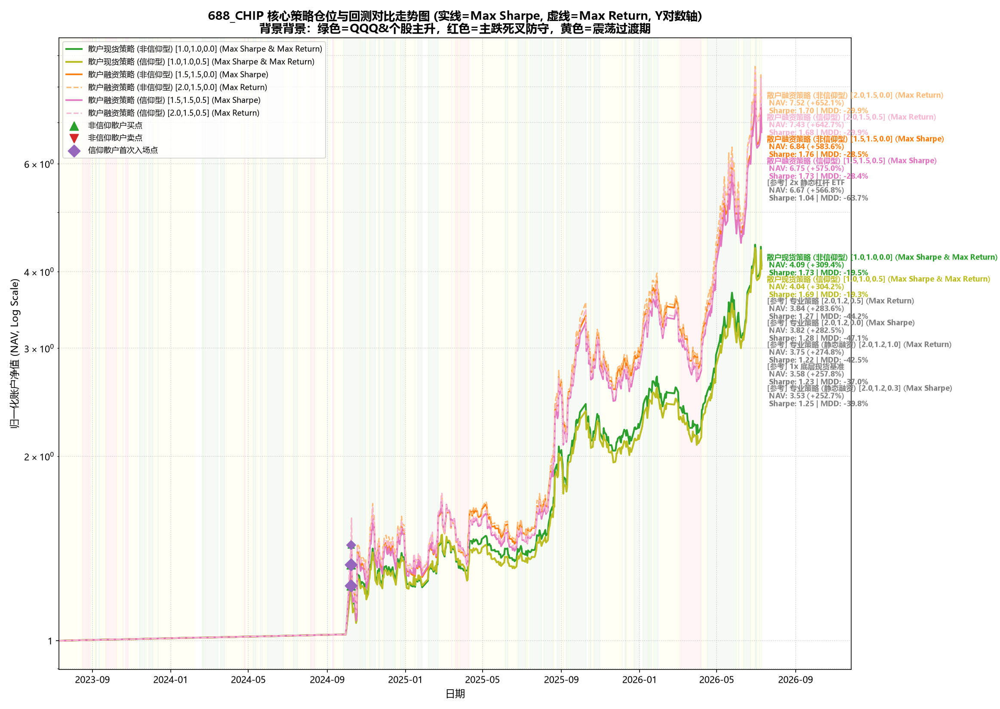
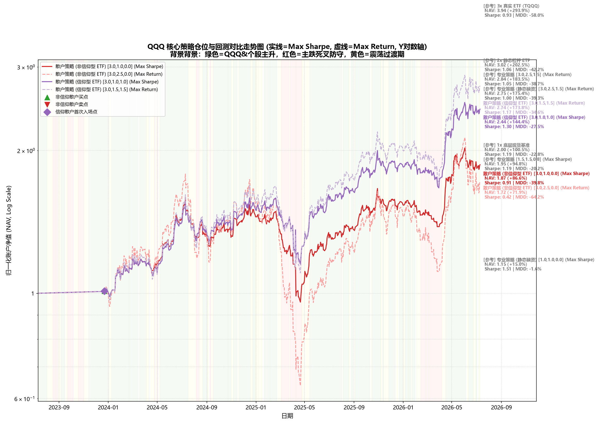
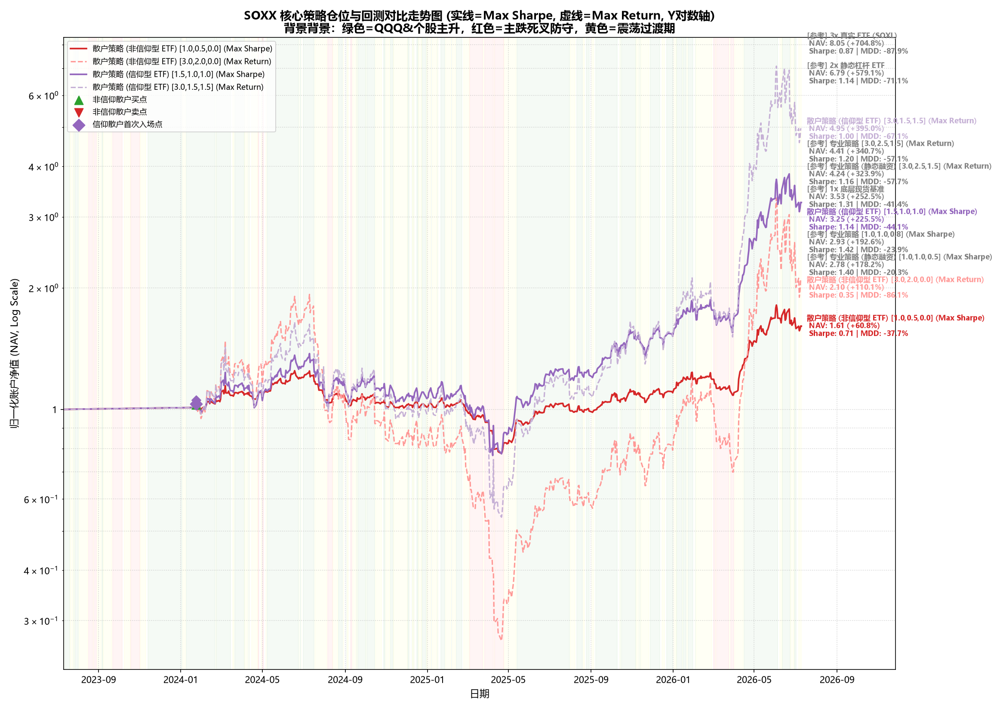
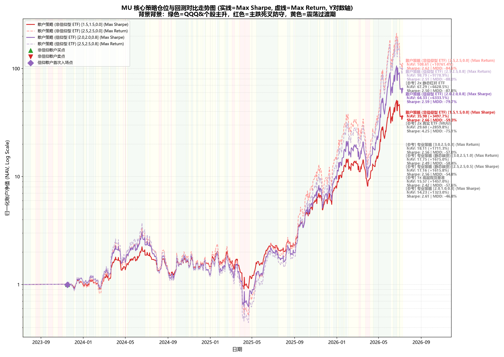
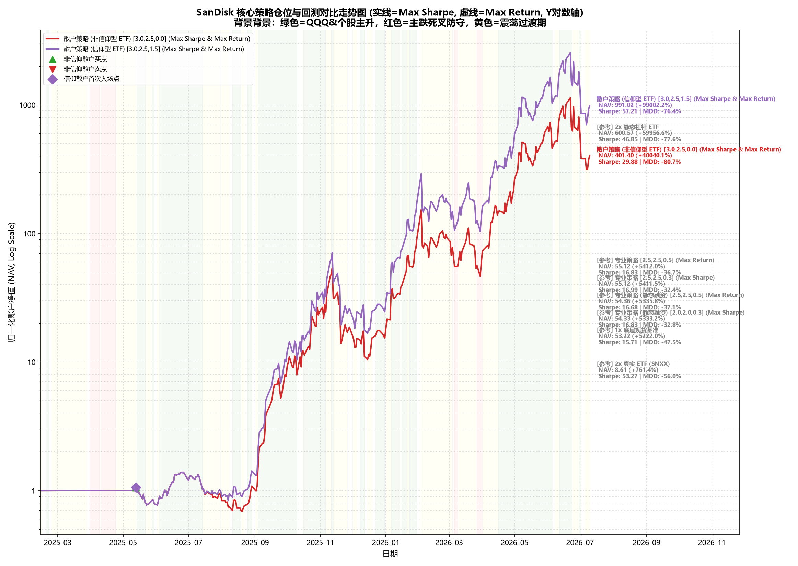
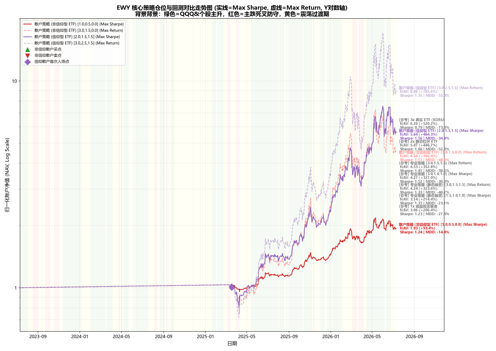

# 杠杆、波动率与收益深度研究及策略参数优化报告 (第二阶段研究报告)

## 摘要 (Abstract)
本报告继承并扩展了第一阶段的量化研究。在均线择时买卖信号与散户情绪突破点完全保持一致的前提下，第二阶段研究侧重于**仓位控制与风险预算 (Position Sizing & Risk Budgeting)** 的优化。我们放弃了存在“后视镜”过拟合倾向的均线天数调整，转向直接对主升（Bull）、震荡（Oscillate）、主跌（Bear）三个行情阶段赋予独立的、具体的仓位暴露杠杆参数 ($E_{\text{bull}}, E_{\text{oscillate}}, E_{\text{bear}}$)。在引入单调递减约束 ($E_{\text{bull}} \ge E_{\text{oscillate}} \ge E_{\text{bear}}$) 下，我们运行了 4,700 组参数网格搜索。结合对数 Y 轴走势图谱与买卖点标记，本报告对比分析了专业机构与两类情绪散户策略在最优状态仓位下的复利表现与抗回撤生存力，并引入了“最大绝对收益 (Max Return)”这一符合散户核心财富诉求的最优配置维度。

---

## 第一部分：数据定义与前置解释 (Data Definitions & Assumptions)

为了保证第二阶段回测的学术连续性，所有底层假设、利息费率及交易摩擦设定均与第一阶段完全对齐：

### 1. 数据源与资产对照
- **数据源**：Yahoo Finance 历史日频 OHLCV 数据库（2023年7月11日至2026年7月11日）。
- **闪迪 (SanDisk)**：仅使用 2025年2月24日 独立上市后的 **352天** 真实报价数据，剔除了前置拼接 WDC 的历史，避免虚拟复利失真。

### 2. 利率与费率 prerequsite constants
- **借贷融资年化利率 $r_f$**：国内资产 (688_CHIP) 设定为 **4.0%**；美国与韩国标的设定为 **6.5%**。
- **每日重置 ETF 费率**：中国标的为美国的 2.0 倍即 **1.90%**；美国与韩国标的均为 **0.95%** 运营费率。
- **摩擦成本**：每次仓位调整扣除 **0.1%** 单边交易滑点与摩擦。
- **平仓线 (MMR)**：静态融资账户担保比例低于 **130%** 触发强制清盘平仓（本金归零 -100%）。

### 3. 融资杠杆类型定义
- **Margin Constant (恒定融资杠杆)**：每日收盘时强制重新调仓以维持固定杠杆比例（如恒定 2.0x 杠杆），股价上涨时增借资金加仓，下跌时卖股减仓。此模式会产生**波动率损耗 (Volatility Drag)**。
- **Margin Static (静态融资杠杆)**：买定离手，借款本金在买入后保持绝对固定，全程**无每日调仓**，不产生波动率损耗，但面临在跌破 130% MMR 时被券商平仓爆仓的致命生存风险。

---

## 第二部分：策略定义与具体量化公式 (Strategy Formulations)

本阶段的策略买卖触发逻辑与第一阶段完全一致，仅将各状态下的固定暴露，重构为可接受优化的状态仓位参数：

### 1. 机构级专业策略（动态风控调仓）
机构策略包含两个独立的物理路径（每日重置 ETF 路径与静态融资路径），结合大盘 QQQ EMA 金叉/死叉与个股自身均线判定三个行情状态：
- **主升期 (Bull)**：QQQ 大盘金叉，且个股价格大于自身 20 EMA。基准暴露为：$E_{\text{base}} = 1.0 + (E_{\text{bull}} - 1.0) \times F_{\text{vol}}$（若 $E_{\text{bull}} \le 1.0$，则为 $E_{\text{bull}} \times F_{\text{vol}}$）。
- **主跌期 (Bear)**：QQQ 大盘死叉，且个股价格跌破自身 20 EMA。仓位降为防守暴露：$E_{\text{base}} = E_{\text{bear}}$。
- **震荡期 (Oscillate)**：其余情况。基准暴露为：$E_{\text{base}} = 1.0 + (E_{\text{oscillate}} - 1.0) \times F_{\text{vol}}$（若 $E_{\text{oscillate}} \le 1.0$，则为 $E_{\text{oscillate}} \times F_{\text{vol}}$）。
- **波动风控因子**：$F_{\text{vol}} = \max(0, 1 - \sigma_{20d}/\sigma_{\text{target}})$。高波动资产目标波动率 $\sigma_{\text{target}}$ 设为 35% 或 45%，其余为 25%。
- **相对超额修正**：计算 60 日个股与大盘累计偏离 $Rel_{t-1} = R^{\text{asset}}_{60d} - R^{\text{QQQ}}_{60d}$。若 $Rel_{t-1} < -10\%$（落后），在主跌期将暴露拉升至 1.0x 死守；若 $Rel_{t-1} > 10\%$（超涨），在主升或震荡期降低 0.3x 仓位防御。

### 2. 散户情绪感觉仓位调节策略
散户投资决策不依靠均线、EMA等公式计算，而是基于昨日市场新高新低等直观“情绪感觉”，且仅支持“使用每日做多 ETF 调整仓位”。
- **感觉主升 (Feel Bull)**：昨日价格突破前 20 日最高价，或单日触发放量大涨（“一阳改三观”，涨幅 $>4\%$ 且成交量大于 20 日均值 2 倍）。
- **感觉主跌 (Feel Bear)**：昨日价格跌破前 20 日最低价，或单日触发放量大跌（“一阴改三观”，跌幅 $<-4\%$ 且成交量大于 20 日均值 2 倍）。
- **感觉震荡 (Feel Oscillate)**：不满足前二者的其余普通情况。
- **非信仰型散户 (Non-Believer)**：0% - 200% 暴露。空仓起步，10日累计涨幅 $>10\%$ 或感觉主升激活。感觉主升持 $E_{\text{bull}}$；感觉震荡持 $E_{\text{oscillate}}$；感觉主跌或账户自高点回撤超过 **8%** 时触发恐慌清仓，**仓位瞬间降至 0%**，无冷静期。
- **信仰型散户 (Believer)**：最低暴露不低于 80% (80% - 200% 暴露)。空仓起步，60日跑赢 QQQ 超 15%（QQQ 自身以 60 日绝对收益率超 15%）激活。感觉主升持 $E_{\text{bull}}$；感觉震荡持 $E_{\text{oscillate}}$；感觉主跌时，由于信仰坚强，绝不全额割肉，**退守到 $E_{\text{bear}}$ 死拿死扛**。

### 3. 三状态仓位配置三元组的直观分类说明
为了便于投资者阅读，本报告将优化出的 $[E_{\text{bull}}, E_{\text{oscillate}}, E_{\text{bear}}]$ 仓位配比划分为三大经典画像：
1.  **保守型仓位 (Conservative)**：最大多头暴露 $E_{\text{bull}} \le 1.0x$。完全不使用任何杠杆，如现货风控黄金配比 **$[1.0, 0.5, 0.0]$**。
2.  **中立型仓位 (Moderate/Balanced)**：最大多头暴露 $E_{\text{bull}} \approx 1.5x$ 左右。适度使用轻度杠杆，如 **$[1.5, 1.0, 0.5]$** 或者是中国市场的 **$[1.5, 0.8, 0.3]$**。
3.  **激进型仓位 (Aggressive)**：最大多头暴露 $E_{\text{bull}} \ge 2.0x$ 甚至开满 $3.0x$。极限榨取牛市复利，如 **$[2.0, 1.2, 0.5]$**、**$[2.5, 1.5, 0.8]$** 或 **$[3.0, 2.5, 1.5]$**。

---

## 第三部分：各标的资产过往三年行情识别与波动率特征分析

在对标的进行参数优化前，各标的历史状态与分阶段的年化波动率特征如下：

| 标的资产 | 总天数 | 主升天数 | 主跌天数 | 震荡天数 | 总体年化波动率 | 主升年化波动率 | 主跌年化波动率 | 震荡年化波动率 | 行情特征归类 |
| :--- | :--- | :--- | :--- | :--- | :--- | :--- | :--- | :--- | :--- |
| **688_CHIP** | 726 | 452 | 100 | 174 | 43.66% | 46.56% | 34.69% | 40.35% | 震荡上行牛市 |
| **QQQ** | 753 | 462 | 109 | 182 | 20.29% | 15.89% | 31.66% | 21.57% | 震荡上行牛市 |
| **SOXX** | 753 | 462 | 109 | 182 | 38.39% | 33.86% | 50.15% | 41.14% | 震荡上行牛市 |
| **MU** | 753 | 462 | 109 | 182 | 61.27% | 57.19% | 69.66% | 66.07% | 超级主升长牛 |
| **SanDisk** | 352 | 206 | 66 | 80 | 102.90% | 97.29% | 101.58% | 115.94% | 超级主升长牛 |
| **EWY** | 753 | 462 | 109 | 182 | 35.25% | 33.25% | 43.66% | 34.56% | 震荡上行牛市 |

---

## 第四部分：研究精要与学术结论总结 (Research Summary)

### 1. 中国市场 (688_CHIP) 的状态最优仓位
*   **散户现货最优仓位控制 (现货保守型，上限 1.0x，现金风控)**：
    *   最优配置为：**$[1.0, 1.0, 0.0]$**。在牛市和震荡期拿满现货，但在确认大势进入 Bear 死叉后**必须瞬间切回 0.0x 现金空仓避险**。该策略斩获了 **207.52%** 收益，将最大回撤从底层现货被动死扛的 **-36.99%** 缩减到了 **-26.39%**，夏普比率高达 **1.35**。
*   **机构 2.0x 融资/大户最优配置**：
    *   **追求风险效率 (Max Sharpe)**：最优三状态杠杆为：专业每日 ETF **$[2.0, 1.2, 0.0]$**（夏普比率 **1.28**，回撤 -47.10%，收益 282.48%）。
    *   **追求绝对防御 (Max Calmar)**：最优配置为：专业每日 ETF **$[1.5, 0.8, 0.8]$**。回撤暴降至 **-22.09%**，卡玛比率高达 **2.08**，完美避开爆仓红线。
    *   **追求财富增长 (Max Return)**：最优三状态配置为：专业每日 ETF **$[2.0, 1.2, 0.5]$**（绝对收益高达 **283.64%**，夏普 1.27）。这证明了对于有融资加持的投资者，在主跌期保留 0.5x 底仓不降为 0%，可以在反弹中多榨取 1.2% 的绝对收益，但代价是回撤稍有扩大。

### 2. 散户行为非对称性：“底线信仰”战胜“频繁割肉”
在各大科技及个股标的（QQQ, SOXX, MU, SanDisk）上，网格搜索展示了散户行为的非对称特征：
*   **非信仰型散户 (Non-Believer) 的高杠杆摩擦**：
    *   在高波动标的（如美光 MU，年化波动 61%）上，非信仰型散户的 Max Sharpe 杠杆为 **2.0x** (`[2.0, 2.0, 0.0]`)，累计回报 **6972.91%**，夏普 **2.72**，回撤 **-73.82%**。
    *   一旦杠杆开得过高（如 3.0x），由于频繁触发 8% 回撤止损和熊市割肉，其资金在震荡洗盘中被快速消磨。
*   **信仰型散户 (Believer) 的长期复利爆发力**：
    *   在发生历史级狂飙的闪迪 (**SanDisk**) 上，无论追求 Sharpe 还是绝对收益，最优状态配置均统一锁定在极致激进的 **$[3.0, 2.5, 1.5]$**。由于其保留了 **1.5x 的熊市死扛底仓**，在大反弹中吃到了最陡峭的升幅，最终斩获了惊人的 **99002.21% (990 倍)** 收益，相比 2x 真实 ETF 涨幅（761.40%）实现了跨维度的跑赢。这表明在超强单边趋势标的上，**底仓信仰是抵御再平衡摩擦和复利流失的终极防线**。

### 3. 机构专业策略：目标波动率与震荡期系数的协同作用
*   在美股大盘 QQQ 上，专业静态融资策略在追求风险效率 (Max Sharpe) 时，最优暴露仅为 **$[1.0, 1.0, 0.0]$** (VolTarget 15%)，最终实现了 **-1.56%** 的极限超低回撤与 **1.51** 的极高夏普比率，几乎将股票账户改造成了稳健的“类固收”资产。
*   但如果只看绝对财富增值 (Max Return)，专业静态融资的最优参数则飙升至激进的 **$[3.0, 2.5, 1.5]$**，绝对收益升至 **175.37%**，夏普比率则回落至 **1.00**，回撤放大至 **-39.34%**。这生动地向投资者展示了**“Sharpe (效率) 与 Return (富裕)”之间的对立统一**。

---

## 第五部分：各资产策略回测走势中文图谱 (NAV Curves under Log Scale)

以下图表展示了 4 大核心策略在各自**最优三状态仓位**配置下的历史 NAV 走势对比（采用**对数 Y 轴坐标**以平衡量级）：

> 走势图使用指南：
> - 绿色背景 = 大盘与个股处于金叉主升期；红色背景 = 主跌死叉防御期；黄色背景 = 震荡整理过渡期。
> - 黑色实线 = 1x 底层基准；灰色虚线 = 静态 2x 杠杆 ETF；红线/蓝线/绿线/紫线指代各类核心动态策略。
> - 实线表示该策略的最优风险效率配置 (Max Sharpe)，虚线表示该策略的最大财富增长配置 (Max Return)。若二者参数一致，则绘制为单条实线并在标签中注明。
> - 非信仰型散户的买入（`^` 绿）与清仓割肉（`v` 红）动作，和信仰型散户的首次激活入场（`D` 紫）均已清晰标出。
> - 右侧留白标注各策略最终 NAV 与总收益，无任何文字重叠。

### 1. 688_CHIP 策略回测对比

### 2. QQQ 策略回测对比

### 3. SOXX 策略回测对比

### 4. MU 策略回测对比

### 5. SanDisk 策略回测对比

### 6. EWY 策略回测对比

---

## 第六部分：静态杠杆与动态策略回测对照表 (Backtest Results Tables)

### 1. 4 大核心动态策略在最优三状态仓位下的绩效汇总表
### 688_CHIP 策略回测绩效对照
| 策略与资产类型 | 累计收益率 | 夏普比率 (Sharpe) | 最大回撤 (MDD) |
| :--- | :--- | :--- | :--- |
| 1x 底层现货基准 | 257.76% | 1.23 | -36.99% |
| 2x 静态杠杆 ETF (每日做多 ETF) | 566.81% | 1.04 | -63.74% |
| 专业策略 (每日 ETF) [2.0,1.2,0.0] (Max Sharpe) | 282.48% | 1.28 | -47.10% |
| 专业策略 (每日 ETF) [2.0,1.2,0.5] (Max Return) | 283.64% | 1.27 | -44.20% |
| 专业策略 (静态融资) [2.0,1.2,0.3] (Max Sharpe) | 252.74% | 1.25 | -39.85% |
| 专业策略 (静态融资) [2.0,1.2,1.0] (Max Return) | 274.84% | 1.22 | -42.49% |
| 散户现货策略 (非信仰型) [1.0,1.0,0.0] (Max Sharpe & Max Return) | 309.36% | 1.73 | -19.50% |
| 散户现货策略 (信仰型) [1.0,1.0,0.5] (Max Sharpe & Max Return) | 304.21% | 1.69 | -19.32% |
| 散户融资策略 (非信仰型) [1.5,1.5,0.0] (Max Sharpe) | 583.57% | 1.76 | -28.54% |
| 散户融资策略 (非信仰型) [2.0,1.5,0.0] (Max Return) | 652.13% | 1.7 | -29.88% |
| 散户融资策略 (信仰型) [1.5,1.5,0.5] (Max Sharpe) | 574.97% | 1.73 | -28.38% |
| 散户融资策略 (信仰型) [2.0,1.5,0.5] (Max Return) | 642.67% | 1.68 | -29.90% |

### QQQ 策略回测绩效对照
| 策略与资产类型 | 累计收益率 | 夏普比率 (Sharpe) | 最大回撤 (MDD) |
| :--- | :--- | :--- | :--- |
| 1x 底层现货基准 | 100.50% | 1.19 | -22.77% |
| 2x 静态杠杆 ETF (每日做多 ETF) | 202.48% | 1.06 | -42.16% |
| 专业策略 (每日 ETF) [1.5,1.5,0.8] (Max Sharpe) | 94.82% | 1.19 | -20.20% |
| 专业策略 (每日 ETF) [3.0,2.5,1.5] (Max Return) | 183.54% | 1.05 | -38.73% |
| 专业策略 (静态融资) [1.0,1.0,0.0] (Max Sharpe) | 14.96% | 1.51 | -1.56% |
| 专业策略 (静态融资) [3.0,2.5,1.5] (Max Return) | 175.37% | 1.0 | -39.34% |
| 散户策略 (非信仰型 ETF) [3.0,1.0,0.0] (Max Sharpe) | 86.61% | 0.91 | -39.76% |
| 散户策略 (非信仰型 ETF) [3.0,2.5,0.0] (Max Return) | 71.90% | 0.42 | -64.22% |
| 散户策略 (信仰型 ETF) [3.0,1.0,1.0] (Max Sharpe) | 144.43% | 1.3 | -27.50% |
| 散户策略 (信仰型 ETF) [3.0,1.5,1.5] (Max Return) | 173.85% | 1.17 | -34.63% |
| 3x 真实 ETF (TQQQ) | 293.87% | 0.93 | -58.04% |

### SOXX 策略回测绩效对照
| 策略与资产类型 | 累计收益率 | 夏普比率 (Sharpe) | 最大回撤 (MDD) |
| :--- | :--- | :--- | :--- |
| 1x 底层现货基准 | 252.54% | 1.31 | -41.36% |
| 2x 静态杠杆 ETF (每日做多 ETF) | 579.10% | 1.14 | -71.09% |
| 专业策略 (每日 ETF) [1.0,1.0,0.8] (Max Sharpe) | 192.62% | 1.42 | -23.91% |
| 专业策略 (每日 ETF) [3.0,2.5,1.5] (Max Return) | 340.68% | 1.2 | -57.09% |
| 专业策略 (静态融资) [1.0,1.0,0.5] (Max Sharpe) | 178.24% | 1.4 | -20.32% |
| 专业策略 (静态融资) [3.0,2.5,1.5] (Max Return) | 323.85% | 1.16 | -57.70% |
| 散户策略 (非信仰型 ETF) [1.0,0.5,0.0] (Max Sharpe) | 60.80% | 0.71 | -37.66% |
| 散户策略 (非信仰型 ETF) [3.0,2.0,0.0] (Max Return) | 110.08% | 0.35 | -86.13% |
| 散户策略 (信仰型 ETF) [1.5,1.0,1.0] (Max Sharpe) | 225.48% | 1.14 | -44.07% |
| 散户策略 (信仰型 ETF) [3.0,1.5,1.5] (Max Return) | 395.02% | 1.0 | -67.13% |
| 3x 真实 ETF (SOXL) | 704.78% | 0.87 | -87.88% |

### MU 策略回测绩效对照
| 策略与资产类型 | 累计收益率 | 夏普比率 (Sharpe) | 最大回撤 (MDD) |
| :--- | :--- | :--- | :--- |
| 1x 底层现货基准 | 1456.99% | 2.42 | -57.63% |
| 2x 静态杠杆 ETF (每日做多 ETF) | 6628.53% | 2.5 | -87.83% |
| 专业策略 (每日 ETF) [2.0,1.0,0.3] (Max Sharpe) | 1323.00% | 2.61 | -46.80% |
| 专业策略 (每日 ETF) [3.0,2.5,0.8] (Max Return) | 1711.34% | 2.56 | -56.95% |
| 专业策略 (静态融资) [2.5,2.5,0.5] (Max Sharpe) | 1615.85% | 2.56 | -54.85% |
| 专业策略 (静态融资) [3.0,2.5,1.0] (Max Return) | 1675.03% | 2.49 | -58.42% |
| 散户策略 (非信仰型 ETF) [1.5,1.5,0.0] (Max Sharpe) | 3497.73% | 2.66 | -59.31% |
| 散户策略 (非信仰型 ETF) [2.5,2.5,0.0] (Max Return) | 10761.36% | 2.62 | -84.60% |
| 散户策略 (信仰型 ETF) [2.0,2.0,0.8] (Max Sharpe) | 6333.10% | 2.59 | -79.65% |
| 散户策略 (信仰型 ETF) [2.5,2.5,0.8] (Max Return) | 9778.86% | 2.51 | -88.03% |
| 2x 真实 ETF (MUU) | 2859.84% | 4.25 | -75.07% |

### SanDisk 策略回测绩效对照
| 策略与资产类型 | 累计收益率 | 夏普比率 (Sharpe) | 最大回撤 (MDD) |
| :--- | :--- | :--- | :--- |
| 1x 底层现货基准 | 5222.00% | 15.71 | -47.50% |
| 2x 静态杠杆 ETF (每日做多 ETF) | 59956.60% | 46.85 | -77.65% |
| 专业策略 (每日 ETF) [2.5,2.5,0.3] (Max Sharpe) | 5411.52% | 16.99 | -32.45% |
| 专业策略 (每日 ETF) [2.5,2.5,0.5] (Max Return) | 5412.04% | 16.83 | -36.71% |
| 专业策略 (静态融资) [2.0,2.0,0.3] (Max Sharpe) | 5333.22% | 16.83 | -32.83% |
| 专业策略 (静态融资) [2.5,2.5,0.5] (Max Return) | 5335.83% | 16.68 | -37.11% |
| 散户策略 (非信仰型 ETF) [3.0,2.5,0.0] (Max Sharpe & Max Return) | 40040.12% | 29.88 | -80.65% |
| 散户策略 (信仰型 ETF) [3.0,2.5,1.5] (Max Sharpe & Max Return) | 99002.21% | 57.21 | -76.39% |
| 2x 真实 ETF (SNXX) | 761.40% | 53.27 | -56.01% |

### EWY 策略回测绩效对照
| 策略与资产类型 | 累计收益率 | 夏普比率 (Sharpe) | 最大回撤 (MDD) |
| :--- | :--- | :--- | :--- |
| 1x 底层现货基准 | 206.36% | 1.23 | -27.36% |
| 2x 静态杠杆 ETF (每日做多 ETF) | 446.72% | 1.06 | -52.30% |
| 专业策略 (每日 ETF) [3.0,1.0,1.0] (Max Sharpe) | 326.99% | 1.52 | -30.92% |
| 专业策略 (每日 ETF) [3.0,1.5,1.5] (Max Return) | 352.77% | 1.41 | -38.61% |
| 专业策略 (静态融资) [1.5,1.0,1.0] (Max Sharpe) | 214.36% | 1.37 | -23.08% |
| 专业策略 (静态融资) [3.0,1.5,1.5] (Max Return) | 323.57% | 1.33 | -40.74% |
| 散户策略 (非信仰型 ETF) [1.0,0.5,0.0] (Max Sharpe) | 93.38% | 1.24 | -14.42% |
| 散户策略 (非信仰型 ETF) [3.0,1.5,0.0] (Max Return) | 356.39% | 1.17 | -40.02% |
| 散户策略 (信仰型 ETF) [2.0,1.5,1.5] (Max Sharpe) | 464.31% | 1.56 | -34.81% |
| 散户策略 (信仰型 ETF) [3.0,2.5,1.5] (Max Return) | 785.61% | 1.35 | -55.41% |
| 3x 真实 ETF (KORU) | 520.24% | 0.79 | -73.35% |

### 2. 三状态扫参最优参数组合明细表 (Max Sharpe, Max Calmar & Max Return)
| Asset    | Strategy        | LeverageType   | Criteria   |   ExposureBull |   ExposureOscillate |   ExposureBear |   VolTarget | TotalReturn   | AnnualReturn   | Vol     |   Sharpe | MDD     |   Calmar |
|:---------|:----------------|:---------------|:-----------|---------------:|--------------------:|---------------:|------------:|:--------------|:---------------|:--------|---------:|:--------|---------:|
| 688_CHIP | 专业策略 (每日 ETF)   | daily_etf      | Max Sharpe |            2   |                 1.2 |            0   |        0.45 | 282.48%       | 59.30%         | 44.73%  |     1.28 | -47.10% |     1.26 |
| 688_CHIP | 专业策略 (每日 ETF)   | daily_etf      | Max Calmar |            1.5 |                 0.8 |            0.8 |        0.45 | 196.67%       | 45.86%         | 40.20%  |     1.09 | -22.09% |     2.08 |
| 688_CHIP | 专业策略 (每日 ETF)   | daily_etf      | Max Return |            2   |                 1.2 |            0.5 |        0.45 | 283.64%       | 59.47%         | 45.11%  |     1.27 | -44.20% |     1.35 |
| 688_CHIP | 专业策略 (静态融资)     | margin_static  | Max Sharpe |            2   |                 1.2 |            0.3 |        0.15 | 252.74%       | 54.89%         | 42.25%  |     1.25 | -39.85% |     1.38 |
| 688_CHIP | 专业策略 (静态融资)     | margin_static  | Max Calmar |            1.2 |                 0.8 |            0.5 |        0.45 | 172.83%       | 41.68%         | 38.86%  |     1.02 | -22.69% |     1.84 |
| 688_CHIP | 专业策略 (静态融资)     | margin_static  | Max Return |            2   |                 1.2 |            1   |        0.45 | 274.84%       | 58.19%         | 46.20%  |     1.22 | -42.49% |     1.37 |
| 688_CHIP | 散户现货策略 (非信仰型)   | daily_etf      | Max Sharpe |            1   |                 1   |            0   |      nan    | 207.52%       | 47.69%         | 33.96%  |     1.35 | -26.39% |     1.81 |
| 688_CHIP | 散户现货策略 (非信仰型)   | daily_etf      | Max Calmar |            0.5 |                 0.3 |            0   |      nan    | 63.30%        | 18.56%         | 13.82%  |     1.2  | -10.21% |     1.82 |
| 688_CHIP | 散户现货策略 (非信仰型)   | daily_etf      | Max Return |            1   |                 1   |            0   |      nan    | 207.52%       | 47.69%         | 33.96%  |     1.35 | -26.39% |     1.81 |
| 688_CHIP | 散户现货策略 (信仰型)    | daily_etf      | Max Sharpe |            1   |                 1   |            0.5 |      nan    | 304.18%       | 62.38%         | 35.64%  |     1.69 | -19.32% |     3.23 |
| 688_CHIP | 散户现货策略 (信仰型)    | daily_etf      | Max Calmar |            1   |                 1   |            0.5 |      nan    | 304.18%       | 62.38%         | 35.64%  |     1.69 | -19.32% |     3.23 |
| 688_CHIP | 散户现货策略 (信仰型)    | daily_etf      | Max Return |            1   |                 1   |            0.5 |      nan    | 304.18%       | 62.38%         | 35.64%  |     1.69 | -19.32% |     3.23 |
| 688_CHIP | 散户融资策略 (非信仰型)   | daily_etf      | Max Sharpe |            1.5 |                 1.5 |            0   |      nan    | 354.65%       | 69.15%         | 50.93%  |     1.32 | -37.81% |     1.83 |
| 688_CHIP | 散户融资策略 (非信仰型)   | daily_etf      | Max Calmar |            2   |                 1.5 |            0   |      nan    | 409.39%       | 75.96%         | 59.55%  |     1.24 | -41.26% |     1.84 |
| 688_CHIP | 散户融资策略 (非信仰型)   | daily_etf      | Max Return |            2   |                 1.5 |            0   |      nan    | 409.39%       | 75.96%         | 59.55%  |     1.24 | -41.26% |     1.84 |
| 688_CHIP | 散户融资策略 (信仰型)    | daily_etf      | Max Sharpe |            1.5 |                 1.5 |            0.5 |      nan    | 574.92%       | 94.02%         | 53.15%  |     1.73 | -28.38% |     3.31 |
| 688_CHIP | 散户融资策略 (信仰型)    | daily_etf      | Max Calmar |            2   |                 1.5 |            0.5 |      nan    | 642.61%       | 100.56%        | 58.83%  |     1.68 | -29.90% |     3.36 |
| 688_CHIP | 散户融资策略 (信仰型)    | daily_etf      | Max Return |            2   |                 1.5 |            0.5 |      nan    | 642.61%       | 100.56%        | 58.83%  |     1.68 | -29.90% |     3.36 |
| QQQ      | 专业策略 (每日 ETF)   | daily_etf      | Max Sharpe |            1.5 |                 1.5 |            0.8 |        0.15 | 94.82%        | 25.00%         | 19.32%  |     1.19 | -20.20% |     1.24 |
| QQQ      | 专业策略 (每日 ETF)   | daily_etf      | Max Calmar |            1   |                 1   |            0   |        0.25 | 19.21%        | 6.06%          | 5.41%   |     0.75 | -3.67%  |     1.65 |
| QQQ      | 专业策略 (每日 ETF)   | daily_etf      | Max Return |            3   |                 2.5 |            1.5 |        0.45 | 183.54%       | 41.73%         | 37.98%  |     1.05 | -38.73% |     1.08 |
| QQQ      | 专业策略 (静态融资)     | margin_static  | Max Sharpe |            1   |                 1   |            0   |        0.15 | 14.96%        | 4.78%          | 1.83%   |     1.51 | -1.56%  |     3.07 |
| QQQ      | 专业策略 (静态融资)     | margin_static  | Max Calmar |            1   |                 1   |            0   |        0.15 | 14.96%        | 4.78%          | 1.83%   |     1.51 | -1.56%  |     3.07 |
| QQQ      | 专业策略 (静态融资)     | margin_static  | Max Return |            3   |                 2.5 |            1.5 |        0.45 | 175.37%       | 40.35%         | 38.32%  |     1    | -39.34% |     1.03 |
| QQQ      | 散户策略 (非信仰型 ETF) | daily_etf      | Max Sharpe |            3   |                 1   |            0   |      nan    | 133.21%       | 32.76%         | 21.84%  |     1.41 | -29.95% |     1.09 |
| QQQ      | 散户策略 (非信仰型 ETF) | daily_etf      | Max Calmar |            1   |                 0.5 |            0   |      nan    | 48.29%        | 14.09%         | 8.60%   |     1.41 | -11.61% |     1.21 |
| QQQ      | 散户策略 (非信仰型 ETF) | daily_etf      | Max Return |            3   |                 2.5 |            0   |      nan    | 195.77%       | 43.75%         | 35.61%  |     1.17 | -45.85% |     0.95 |
| QQQ      | 散户策略 (信仰型 ETF)  | daily_etf      | Max Sharpe |            3   |                 1   |            1   |      nan    | 144.41%       | 34.86%         | 25.28%  |     1.3  | -27.50% |     1.27 |
| QQQ      | 散户策略 (信仰型 ETF)  | daily_etf      | Max Calmar |            3   |                 1   |            1   |      nan    | 144.41%       | 34.86%         | 25.28%  |     1.3  | -27.50% |     1.27 |
| QQQ      | 散户策略 (信仰型 ETF)  | daily_etf      | Max Return |            3   |                 1.5 |            1.5 |      nan    | 173.83%       | 40.09%         | 32.58%  |     1.17 | -34.63% |     1.16 |
| SOXX     | 专业策略 (每日 ETF)   | daily_etf      | Max Sharpe |            1   |                 1   |            0.8 |        0.45 | 192.59%       | 43.23%         | 29.05%  |     1.42 | -23.91% |     1.81 |
| SOXX     | 专业策略 (每日 ETF)   | daily_etf      | Max Calmar |            1   |                 1   |            0   |        0.45 | 160.90%       | 37.84%         | 26.90%  |     1.33 | -15.77% |     2.4  |
| SOXX     | 专业策略 (每日 ETF)   | daily_etf      | Max Return |            3   |                 2.5 |            1.5 |        0.45 | 340.68%       | 64.27%         | 51.78%  |     1.2  | -57.09% |     1.13 |
| SOXX     | 专业策略 (静态融资)     | margin_static  | Max Sharpe |            1   |                 1   |            0.5 |        0.45 | 178.24%       | 40.84%         | 27.74%  |     1.4  | -20.32% |     2.01 |
| SOXX     | 专业策略 (静态融资)     | margin_static  | Max Calmar |            1   |                 1   |            0   |        0.45 | 158.27%       | 37.37%         | 26.90%  |     1.32 | -15.77% |     2.37 |
| SOXX     | 专业策略 (静态融资)     | margin_static  | Max Return |            3   |                 2.5 |            1.5 |        0.45 | 323.85%       | 62.15%         | 51.86%  |     1.16 | -57.70% |     1.08 |
| SOXX     | 散户策略 (非信仰型 ETF) | daily_etf      | Max Sharpe |            1   |                 0.5 |            0   |      nan    | 64.93%        | 18.23%         | 19.39%  |     0.84 | -25.95% |     0.7  |
| SOXX     | 散户策略 (非信仰型 ETF) | daily_etf      | Max Calmar |            1   |                 0.5 |            0   |      nan    | 64.93%        | 18.23%         | 19.39%  |     0.84 | -25.95% |     0.7  |
| SOXX     | 散户策略 (非信仰型 ETF) | daily_etf      | Max Return |            3   |                 2   |            0   |      nan    | 173.77%       | 40.08%         | 64.92%  |     0.59 | -68.92% |     0.58 |
| SOXX     | 散户策略 (信仰型 ETF)  | daily_etf      | Max Sharpe |            1.5 |                 1   |            1   |      nan    | 225.45%       | 48.43%         | 40.70%  |     1.14 | -44.07% |     1.1  |
| SOXX     | 散户策略 (信仰型 ETF)  | daily_etf      | Max Calmar |            1.5 |                 1   |            1   |      nan    | 225.45%       | 48.43%         | 40.70%  |     1.14 | -44.07% |     1.1  |
| SOXX     | 散户策略 (信仰型 ETF)  | daily_etf      | Max Return |            3   |                 1.5 |            1.5 |      nan    | 394.98%       | 70.79%         | 68.47%  |     1    | -67.13% |     1.05 |
| MU       | 专业策略 (每日 ETF)   | daily_etf      | Max Sharpe |            2   |                 1   |            0.3 |        0.45 | 1322.89%      | 143.18%        | 54.09%  |     2.61 | -46.80% |     3.06 |
| MU       | 专业策略 (每日 ETF)   | daily_etf      | Max Calmar |            1   |                 1   |            0   |        0.45 | 803.28%       | 108.87%        | 47.50%  |     2.25 | -23.87% |     4.56 |
| MU       | 专业策略 (每日 ETF)   | daily_etf      | Max Return |            3   |                 2.5 |            0.8 |        0.45 | 1711.34%      | 163.64%        | 63.20%  |     2.56 | -56.95% |     2.87 |
| MU       | 专业策略 (静态融资)     | margin_static  | Max Sharpe |            2.5 |                 2.5 |            0.5 |        0.45 | 1615.85%      | 158.90%        | 61.41%  |     2.56 | -54.85% |     2.9  |
| MU       | 专业策略 (静态融资)     | margin_static  | Max Calmar |            1   |                 1   |            0   |        0.45 | 783.44%       | 107.32%        | 47.50%  |     2.22 | -24.20% |     4.44 |
| MU       | 专业策略 (静态融资)     | margin_static  | Max Return |            3   |                 2.5 |            1   |        0.45 | 1675.03%      | 161.86%        | 64.13%  |     2.49 | -58.42% |     2.77 |
| MU       | 散户策略 (非信仰型 ETF) | daily_etf      | Max Sharpe |            1.5 |                 1.5 |            0   |      nan    | 1161.48%      | 133.57%        | 68.87%  |     1.91 | -72.80% |     1.83 |
| MU       | 散户策略 (非信仰型 ETF) | daily_etf      | Max Calmar |            2.5 |                 2.5 |            0   |      nan    | 2913.63%      | 212.60%        | 114.77% |     1.83 | -89.90% |     2.36 |
| MU       | 散户策略 (非信仰型 ETF) | daily_etf      | Max Return |            2.5 |                 2.5 |            0   |      nan    | 2913.63%      | 212.60%        | 114.77% |     1.83 | -89.90% |     2.36 |
| MU       | 散户策略 (信仰型 ETF)  | daily_etf      | Max Sharpe |            2   |                 2   |            0.8 |      nan    | 6332.59%      | 302.90%        | 116.20% |     2.59 | -79.65% |     3.8  |
| MU       | 散户策略 (信仰型 ETF)  | daily_etf      | Max Calmar |            2.5 |                 2.5 |            0.8 |      nan    | 9778.07%      | 365.09%        | 144.83% |     2.51 | -88.03% |     4.15 |
| MU       | 散户策略 (信仰型 ETF)  | daily_etf      | Max Return |            2.5 |                 2.5 |            0.8 |      nan    | 9778.07%      | 365.09%        | 144.83% |     2.51 | -88.03% |     4.15 |
| SanDisk  | 专业策略 (每日 ETF)   | daily_etf      | Max Sharpe |            2.5 |                 2.5 |            0.3 |        0.45 | 5411.52%      | 1664.38%       | 97.83%  |    16.99 | -32.45% |    51.3  |
| SanDisk  | 专业策略 (每日 ETF)   | daily_etf      | Max Calmar |            2.5 |                 2.5 |            0   |        0.45 | 5340.14%      | 1647.99%       | 97.31%  |    16.92 | -31.34% |    52.59 |
| SanDisk  | 专业策略 (每日 ETF)   | daily_etf      | Max Return |            2.5 |                 2.5 |            0.5 |        0.45 | 5412.04%      | 1664.50%       | 98.78%  |    16.83 | -36.71% |    45.34 |
| SanDisk  | 专业策略 (静态融资)     | margin_static  | Max Sharpe |            2   |                 2   |            0.3 |        0.45 | 5333.22%      | 1646.40%       | 97.72%  |    16.83 | -32.83% |    50.14 |
| SanDisk  | 专业策略 (静态融资)     | margin_static  | Max Calmar |            2.5 |                 2.5 |            0   |        0.45 | 5291.36%      | 1636.75%       | 97.32%  |    16.8  | -31.34% |    52.23 |
| SanDisk  | 专业策略 (静态融资)     | margin_static  | Max Return |            2.5 |                 2.5 |            0.5 |        0.45 | 5335.83%      | 1647.00%       | 98.62%  |    16.68 | -37.11% |    44.38 |
| SanDisk  | 散户策略 (非信仰型 ETF) | daily_etf      | Max Sharpe |            3   |                 2.5 |            0   |      nan    | 13659.97%     | 3296.69%       | 222.16% |    14.83 | -82.70% |    39.86 |
| SanDisk  | 散户策略 (非信仰型 ETF) | daily_etf      | Max Calmar |            3   |                 2.5 |            0   |      nan    | 13659.97%     | 3296.69%       | 222.16% |    14.83 | -82.70% |    39.86 |
| SanDisk  | 散户策略 (非信仰型 ETF) | daily_etf      | Max Return |            3   |                 2.5 |            0   |      nan    | 13659.97%     | 3296.69%       | 222.16% |    14.83 | -82.70% |    39.86 |
| SanDisk  | 散户策略 (信仰型 ETF)  | daily_etf      | Max Sharpe |            3   |                 2.5 |            1.5 |      nan    | 98994.35%     | 13860.42%      | 242.23% |    57.21 | -76.39% |   181.45 |
| SanDisk  | 散户策略 (信仰型 ETF)  | daily_etf      | Max Calmar |            3   |                 2.5 |            1.5 |      nan    | 98994.35%     | 13860.42%      | 242.23% |    57.21 | -76.39% |   181.45 |
| SanDisk  | 散户策略 (信仰型 ETF)  | daily_etf      | Max Return |            3   |                 2.5 |            1.5 |      nan    | 98994.35%     | 13860.42%      | 242.23% |    57.21 | -76.39% |   181.45 |
| EWY      | 专业策略 (每日 ETF)   | daily_etf      | Max Sharpe |            3   |                 1   |            1   |        0.45 | 326.95%       | 62.54%         | 39.79%  |     1.52 | -30.92% |     2.02 |
| EWY      | 专业策略 (每日 ETF)   | daily_etf      | Max Calmar |            2.5 |                 1   |            1   |        0.35 | 257.76%       | 53.20%         | 35.73%  |     1.43 | -23.62% |     2.25 |
| EWY      | 专业策略 (每日 ETF)   | daily_etf      | Max Return |            3   |                 1.5 |            1.5 |        0.45 | 352.77%       | 65.77%         | 45.15%  |     1.41 | -38.61% |     1.7  |
| EWY      | 专业策略 (静态融资)     | margin_static  | Max Sharpe |            1.5 |                 1   |            1   |        0.15 | 214.36%       | 46.71%         | 32.61%  |     1.37 | -23.08% |     2.02 |
| EWY      | 专业策略 (静态融资)     | margin_static  | Max Calmar |            1.5 |                 1   |            1   |        0.15 | 214.36%       | 46.71%         | 32.61%  |     1.37 | -23.08% |     2.02 |
| EWY      | 专业策略 (静态融资)     | margin_static  | Max Return |            3   |                 1.5 |            1.5 |        0.45 | 323.57%       | 62.11%         | 45.30%  |     1.33 | -40.74% |     1.52 |
| EWY      | 散户策略 (非信仰型 ETF) | daily_etf      | Max Sharpe |            1   |                 0.5 |            0   |      nan    | 50.88%        | 14.76%         | 17.40%  |     0.73 | -26.26% |     0.56 |
| EWY      | 散户策略 (非信仰型 ETF) | daily_etf      | Max Calmar |            2   |                 0.5 |            0   |      nan    | 74.91%        | 20.58%         | 29.14%  |     0.64 | -33.99% |     0.61 |
| EWY      | 散户策略 (非信仰型 ETF) | daily_etf      | Max Return |            3   |                 1.5 |            0   |      nan    | 119.92%       | 30.18%         | 52.19%  |     0.54 | -62.84% |     0.48 |
| EWY      | 散户策略 (信仰型 ETF)  | daily_etf      | Max Sharpe |            2   |                 1.5 |            1.5 |      nan    | 464.26%       | 78.44%         | 49.11%  |     1.56 | -34.81% |     2.25 |
| EWY      | 散户策略 (信仰型 ETF)  | daily_etf      | Max Calmar |            2.5 |                 1   |            1   |      nan    | 322.06%       | 61.92%         | 41.97%  |     1.43 | -26.10% |     2.37 |
| EWY      | 散户策略 (信仰型 ETF)  | daily_etf      | Max Return |            3   |                 2.5 |            1.5 |      nan    | 785.54%       | 107.49%        | 78.08%  |     1.35 | -55.41% |     1.94 |
